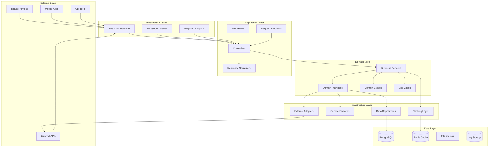
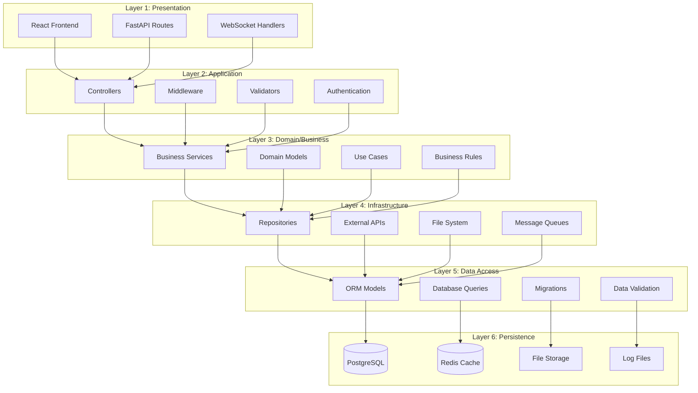
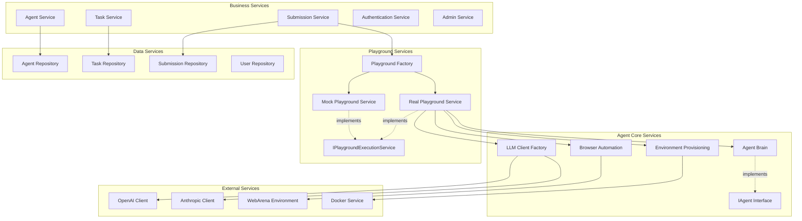
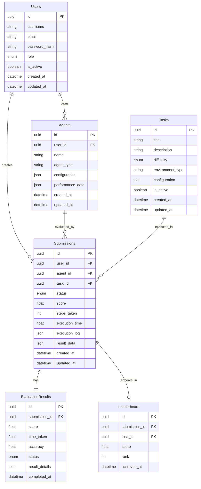
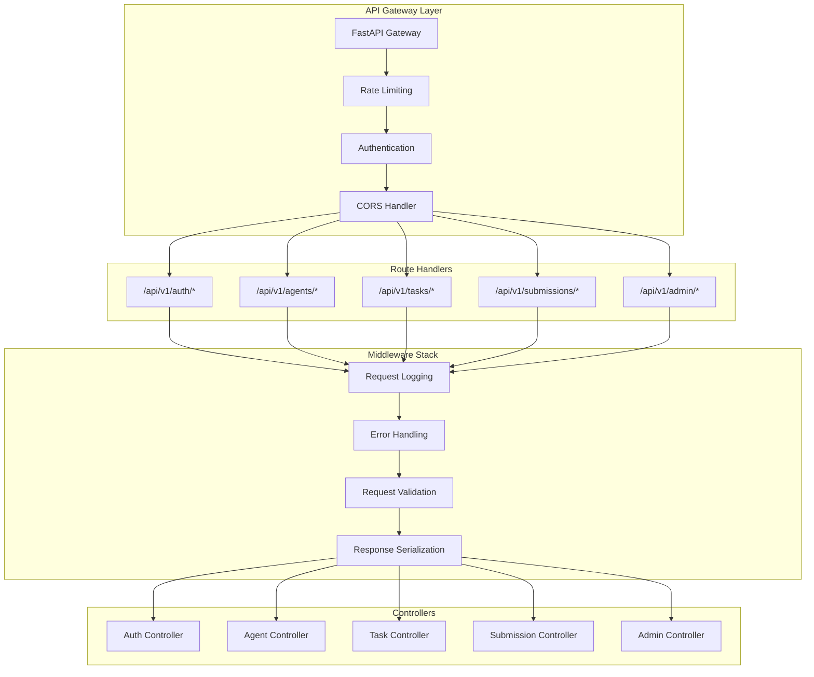
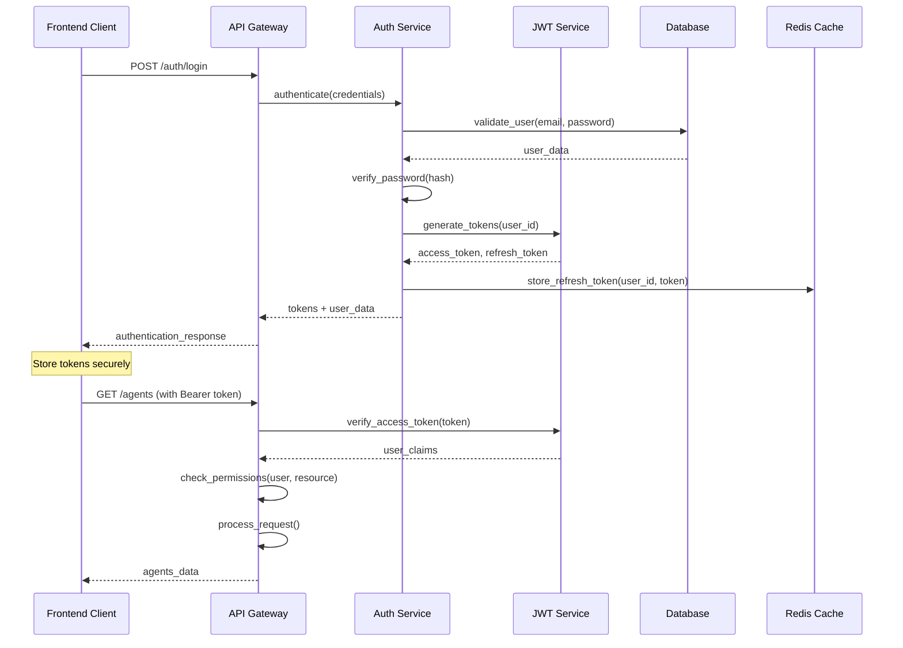
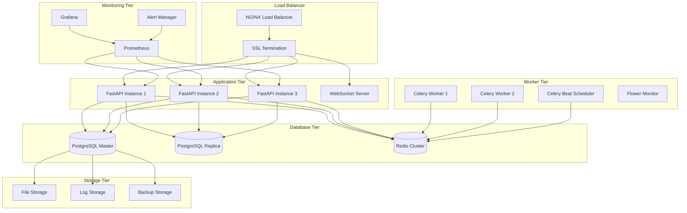
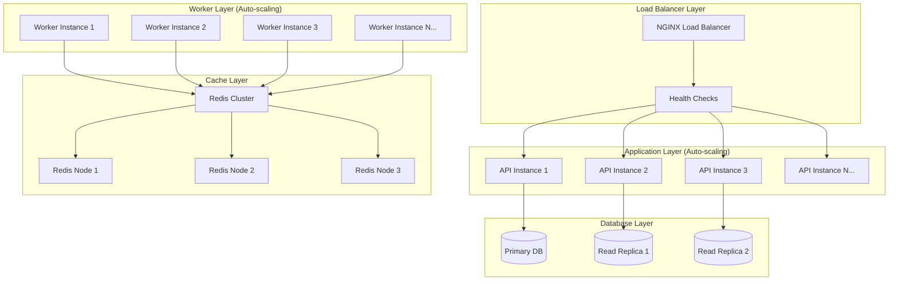

# AgentArena - System Architecture Documentation

[](README.md)
[](README.md)
[](README.md)

> **Comprehensive Architecture Documentation** - Detailed technical architecture, design patterns, and implementation guidelines for the AgentArena platform.

---

## 📋 Table of Contents

- [Architecture Overview](#architecture-overview)
- [System Design](#system-design)
- [Component Architecture](#component-architecture)
- [Database Design](#database-design)
- [API Architecture](#api-architecture)
- [Security Architecture](#security-architecture)
- [Deployment Architecture](#deployment-architecture)
- [Design Patterns](#design-patterns)
- [Performance Considerations](#performance-considerations)
- [Monitoring & Observability](#monitoring--observability)
- [Scalability Strategy](#scalability-strategy)
- [Development Guidelines](#development-guidelines)

---

## 🏗️ Architecture Overview

AgentArena follows a **Clean Architecture** approach with strict separation of concerns, implementing enterprise-grade design patterns for maximum maintainability, testability, and scalability.

### Architectural Principles

- **🎯 Single Responsibility**: Each component has one well-defined purpose
- **🔒 Dependency Inversion**: High-level modules don't depend on low-level modules
- **🔄 Open/Closed**: Open for extension, closed for modification
- **🧩 Interface Segregation**: Clients depend only on interfaces they use
- **🔗 Liskov Substitution**: Objects can be replaced with instances of their subtypes
- **📦 Separation of Concerns**: Clear boundaries between different responsibilities
- **🚀 Async-First**: Built for high-performance concurrent operations

### High-Level System Architecture



---

## 🏛️ System Design

### Layered Architecture

AgentArena implements a 6-layer architecture for optimal separation of concerns:



### Technology Stack

| Layer                 | Technology     | Purpose               | Version |
| --------------------- | -------------- | --------------------- | ------- |
| **Frontend**          | React 18+      | User Interface        | 18.2+   |
| **Build Tool**        | Vite           | Fast Development      | 4.0+    |
| **Styling**           | TailwindCSS    | Utility-First CSS     | 3.3+    |
| **State Management**  | Redux Toolkit  | Predictable State     | 1.9+    |
| **API Client**        | React Query    | Server State          | 4.0+    |
| **Backend Framework** | FastAPI        | Async Python API      | 0.104+  |
| **Database ORM**      | SQLAlchemy 2.0 | Async Database ORM    | 2.0+    |
| **Database**          | PostgreSQL     | Primary Database      | 15+     |
| **Cache**             | Redis          | In-Memory Cache       | 7.0+    |
| **Authentication**    | JWT + bcrypt   | Secure Auth           | -       |
| **Validation**        | Pydantic v2    | Data Validation       | 2.0+    |
| **Testing**           | pytest + httpx | Async Testing         | -       |
| **Containerization**  | Docker         | Environment Isolation | 24+     |
| **Orchestration**     | Docker Compose | Multi-Container       | 2.20+   |

---

## 🧩 Component Architecture

### Core Service Architecture



### Playground Execution Flow

```mermaid
sequenceDiagram
    participant Client as Frontend Client
    participant API as FastAPI Router
    participant Controller as Submission Controller
    participant Service as Submission Service
    participant Factory as Playground Factory
    participant RealPG as Real Playground Service
    participant Agent as Agent Brain
    participant Browser as Browser Automation
    participant Env as Environment Provisioning
    participant LLM as LLM Client

    Client->>API: POST /api/v1/submissions
    API->>Controller: create_submission()
    Controller->>Service: create_submission()
    Service->>Factory: get_playground_service()
    Factory->>RealPG: create_instance()
    Service->>RealPG: execute_playground_run()
    RealPG->>Env: create_environment()
    Env-->>RealPG: environment_config
    RealPG->>Agent: initialize(llm_client, config, task)
    Agent-->>RealPG: initialized_agent
    RealPG->>Browser: WebBrowserAutomation(env)
    Browser-->>RealPG: browser_instance

    loop Execution Loop
        RealPG->>Browser: get_page_content()
        Browser-->>RealPG: observation
        RealPG->>Agent: decide_action(observation)
        Agent->>LLM: generate_response()
        LLM-->>Agent: response
        Agent-->>RealPG: action
        RealPG->>Browser: execute_action(action)
        Browser-->>RealPG: result
        RealPG->>RealPG: check_completion_criteria()

        alt Task Complete
            break
        end

        RealPG->>Client: progress_update (via WebSocket)
    end

    RealPG->>Browser: close()
    RealPG->>Agent: reset()
    RealPG-->>Service: PlaygroundRunOutput
    Service-->>Controller: SubmissionResponse
    Controller-->>API: JSON response
    API-->>Client: Created (201)
```

---

## 🗄️ Database Design

### Entity Relationship Diagram



### Database Schema Details

#### Core Tables

| Table                  | Purpose           | Key Features                                           |
| ---------------------- | ----------------- | ------------------------------------------------------ |
| **users**              | User management   | UUID primary keys, bcrypt passwords, role-based access |
| **agents**             | Agent definitions | JSON configuration, performance tracking               |
| **tasks**              | Evaluation tasks  | Environment configs, difficulty levels                 |
| **submissions**        | Execution records | Complete execution state, logs, results                |
| **evaluation_results** | Detailed metrics  | Performance analytics, scoring data                    |
| **leaderboard**        | Rankings          | Global and task-specific rankings                      |

#### Indexing Strategy

```sql
-- Performance indexes
CREATE INDEX idx_submissions_user_created ON submissions(user_id, created_at DESC);
CREATE INDEX idx_submissions_status ON submissions(status);
CREATE INDEX idx_leaderboard_task_score ON leaderboard(task_id, score DESC);
CREATE INDEX idx_agents_user_active ON agents(user_id, created_at DESC);

-- Composite indexes for analytics
CREATE INDEX idx_submissions_analytics ON submissions(user_id, status, created_at);
CREATE INDEX idx_evaluation_performance ON evaluation_results(submission_id, score, time_taken);
```

---

## 🔌 API Architecture

### RESTful API Design



### API Standards

#### Request/Response Format

```json
// Standard Request Format
{
  "data": {
    "type": "agent",
    "attributes": {
      "name": "GPT-4 Agent",
      "agentType": "gpt-4",
      "configuration": {}
    }
  },
  "meta": {
    "timestamp": "2024-01-15T10:30:00Z",
    "requestId": "req_123456"
  }
}

// Standard Response Format
{
  "data": {
    "type": "agent",
    "id": "agent_uuid",
    "attributes": {
      "name": "GPT-4 Agent",
      "agentType": "gpt-4",
      "createdAt": "2024-01-15T10:30:00Z"
    }
  },
  "meta": {
    "timestamp": "2024-01-15T10:30:00Z",
    "requestId": "req_123456"
  }
}

// Error Response Format
{
  "errors": [
    {
      "code": "VALIDATION_ERROR",
      "message": "Invalid agent configuration",
      "field": "agentType",
      "details": {
        "allowed_values": ["gpt-4", "gpt-3.5-turbo", "claude-3"]
      }
    }
  ],
  "meta": {
    "timestamp": "2024-01-15T10:30:00Z",
    "requestId": "req_123456"
  }
}
```

#### HTTP Status Code Strategy

| Status Code                   | Usage                   | Example                     |
| ----------------------------- | ----------------------- | --------------------------- |
| **200 OK**                    | Successful GET, PUT     | Retrieve agent, update task |
| **201 Created**               | Successful POST         | Create agent, submit task   |
| **204 No Content**            | Successful DELETE       | Delete agent                |
| **400 Bad Request**           | Client error            | Invalid input data          |
| **401 Unauthorized**          | Authentication required | Missing/invalid token       |
| **403 Forbidden**             | Authorization failed    | Insufficient permissions    |
| **404 Not Found**             | Resource not found      | Agent/task doesn't exist    |
| **409 Conflict**              | Resource conflict       | Duplicate agent name        |
| **422 Unprocessable Entity**  | Validation error        | Invalid data format         |
| **429 Too Many Requests**     | Rate limit exceeded     | API rate limiting           |
| **500 Internal Server Error** | Server error            | Unexpected server error     |

---

## 🔒 Security Architecture

### Authentication & Authorization Flow



### Security Layers

#### 1. Transport Security

- **HTTPS Enforcement**: TLS 1.3 in production
- **HSTS Headers**: HTTP Strict Transport Security
- **Certificate Pinning**: Mobile apps pin certificates

#### 2. Authentication Security

- **JWT Tokens**: Stateless authentication with RS256 signing
- **Refresh Token Rotation**: Automatic rotation on refresh
- **Token Expiration**: Short-lived access tokens (15 min)
- **Secure Storage**: httpOnly cookies for web, keychain for mobile

#### 3. Authorization Security

- **Role-Based Access Control (RBAC)**: USER, ADMIN, SUPER_ADMIN
- **Resource-Level Permissions**: Granular access control
- **API Key Management**: Secure handling of LLM provider keys
- **Rate Limiting**: Per-user and per-endpoint limits

#### 4. Input Security

- **Request Validation**: Comprehensive Pydantic validation
- **SQL Injection Prevention**: Parameterized queries with SQLAlchemy
- **XSS Prevention**: Output encoding and CSP headers
- **CSRF Protection**: SameSite cookies and CSRF tokens

#### 5. Data Security

- **Password Hashing**: bcrypt with configurable rounds
- **API Key Encryption**: AES-256 encryption for stored keys
- **Database Encryption**: Encryption at rest for sensitive data
- **Audit Logging**: Comprehensive access and change logging

---

## 🚀 Deployment Architecture

### Container Architecture



### Environment Configuration

#### Development Environment

```yaml
# docker-compose.dev.yml
version: '3.8'
services:
  api:
    build: ./Server
    environment:
      - DATABASE_URL=postgresql://dev:dev@db:5432/agentarena_dev
      - REDIS_URL=redis://redis:6379/0
      - LOG_LEVEL=DEBUG
    volumes:
      - ./Server:/app
    command: uvicorn main:app --reload --host 0.0.0.0

  frontend:
    build: ./client
    environment:
      - VITE_API_BASE_URL=http://localhost:8000
    volumes:
      - ./client:/app
    command: npm run dev

  db:
    image: postgres:15
    environment:
      - POSTGRES_DB=agentarena_dev
      - POSTGRES_USER=dev
      - POSTGRES_PASSWORD=dev

  redis:
    image: redis:7-alpine
```

#### Production Environment

```yaml
# docker-compose.prod.yml
version: '3.8'
services:
  nginx:
    image: nginx:alpine
    ports:
      - '80:80'
      - '443:443'
    volumes:
      - ./nginx.conf:/etc/nginx/nginx.conf
      - ./ssl:/etc/ssl

  api:
    build: ./Server
    environment:
      - DATABASE_URL=${DATABASE_URL}
      - REDIS_URL=${REDIS_URL}
      - SECRET_KEY=${SECRET_KEY}
      - LOG_LEVEL=INFO
    deploy:
      replicas: 3
      resources:
        limits:
          memory: 512M
          cpus: '0.5'

  worker:
    build: ./Server
    command: celery -A app.worker worker --loglevel=info
    environment:
      - DATABASE_URL=${DATABASE_URL}
      - REDIS_URL=${REDIS_URL}
    deploy:
      replicas: 2

  db:
    image: postgres:15
    environment:
      - POSTGRES_DB=${POSTGRES_DB}
      - POSTGRES_USER=${POSTGRES_USER}
      - POSTGRES_PASSWORD=${POSTGRES_PASSWORD}
    volumes:
      - postgres_data:/var/lib/postgresql/data

  redis:
    image: redis:7-alpine
    volumes:
      - redis_data:/data
```

---

## 🎨 Design Patterns

### Implemented Patterns

#### 1. Repository Pattern

```python
# Abstract Repository Interface
class IRepository(ABC):
    @abstractmethod
    async def create(self, entity: T) -> T:
        pass

    @abstractmethod
    async def get_by_id(self, id: UUID) -> Optional[T]:
        pass

    @abstractmethod
    async def update(self, entity: T) -> T:
        pass

    @abstractmethod
    async def delete(self, id: UUID) -> bool:
        pass

# Concrete Implementation
class AgentRepository(IRepository[Agent]):
    def __init__(self, db: AsyncSession):
        self.db = db

    async def create(self, agent: Agent) -> Agent:
        self.db.add(agent)
        await self.db.commit()
        await self.db.refresh(agent)
        return agent
```

#### 2. Factory Pattern

```python
# Service Factory
class PlaygroundServiceFactory:
    @staticmethod
    async def create_service() -> IPlaygroundExecutionService:
        use_real = settings.USE_REAL_PLAYGROUND

        if use_real:
            service = RealPlaygroundService()
            if await service.health_check():
                return service

        return MockPlaygroundService()

# LLM Client Factory
class LLMClientFactory:
    def create_client(self, config: Dict[str, Any]) -> BaseLLM:
        provider = config.get("provider", "mock")

        if provider == "openai":
            return OpenAIClient(config)
        elif provider == "anthropic":
            return AnthropicClient(config)
        else:
            return MockLLMClient(config)
```

#### 3. Strategy Pattern

```python
# Evaluation Strategy Interface
class IEvaluationStrategy(ABC):
    @abstractmethod
    async def evaluate(self, result: ExecutionResult) -> EvaluationScore:
        pass

# Concrete Strategies
class TaskCompletionStrategy(IEvaluationStrategy):
    async def evaluate(self, result: ExecutionResult) -> EvaluationScore:
        # Task completion evaluation logic
        pass

class EfficiencyStrategy(IEvaluationStrategy):
    async def evaluate(self, result: ExecutionResult) -> EvaluationScore:
        # Efficiency evaluation logic
        pass
```

#### 4. Observer Pattern

```python
# Event System for Real-time Updates
class EventPublisher:
    def __init__(self):
        self._observers = []

    def subscribe(self, observer: IObserver):
        self._observers.append(observer)

    async def notify(self, event: Event):
        for observer in self._observers:
            await observer.handle(event)

# WebSocket Observer
class WebSocketObserver(IObserver):
    async def handle(self, event: Event):
        await self.websocket.send_json({
            "type": event.type,
            "data": event.data
        })
```

#### 5. Dependency Injection

```python
# Service Container
class Container:
    def __init__(self):
        self._services = {}
        self._factories = {}

    def register(self, interface: Type, implementation: Type):
        self._services[interface] = implementation

    def register_factory(self, interface: Type, factory: Callable):
        self._factories[interface] = factory

    def get(self, interface: Type):
        if interface in self._factories:
            return self._factories[interface]()
        return self._services[interface]()

# Usage in FastAPI Dependencies
async def get_agent_service(
    db: AsyncSession = Depends(get_db)
) -> AgentService:
    repository = AgentRepository(db)
    return AgentService(repository)
```

---

## ⚡ Performance Considerations

### Async Architecture

```python
# Async Request Handling
@router.post("/submissions")
async def create_submission(
    submission_data: SubmissionCreate,
    background_tasks: BackgroundTasks,
    current_user: User = Depends(get_current_user),
    db: AsyncSession = Depends(get_db)
):
    # Create submission record immediately
    submission = await submission_service.create_submission(
        db, submission_data, current_user.id
    )

    # Process in background
    background_tasks.add_task(
        process_submission_async,
        submission.id
    )

    return submission

# Async Database Operations
async def get_user_submissions(
    user_id: UUID,
    db: AsyncSession,
    skip: int = 0,
    limit: int = 20
) -> List[Submission]:
    result = await db.execute(
        select(Submission)
        .where(Submission.user_id == user_id)
        .offset(skip)
        .limit(limit)
        .options(selectinload(Submission.agent))
    )
    return result.scalars().all()
```

### Caching Strategy

```python
# Redis Caching Layer
class CacheService:
    def __init__(self, redis: Redis):
        self.redis = redis

    async def get_leaderboard(self, task_id: UUID) -> Optional[List[Dict]]:
        cache_key = f"leaderboard:{task_id}"
        cached = await self.redis.get(cache_key)

        if cached:
            return json.loads(cached)
        return None

    async def set_leaderboard(
        self,
        task_id: UUID,
        data: List[Dict],
        ttl: int = 300
    ):
        cache_key = f"leaderboard:{task_id}"
        await self.redis.setex(
            cache_key,
            ttl,
            json.dumps(data, default=str)
        )

# Service with Caching
class LeaderboardService:
    async def get_task_leaderboard(self, task_id: UUID) -> List[Dict]:
        # Try cache first
        cached = await self.cache.get_leaderboard(task_id)
        if cached:
            return cached

        # Query database
        leaderboard = await self.repository.get_task_leaderboard(task_id)

        # Cache result
        await self.cache.set_leaderboard(task_id, leaderboard)

        return leaderboard
```

### Database Optimization

```python
# Query Optimization with Eager Loading
async def get_submission_with_details(
    submission_id: UUID,
    db: AsyncSession
) -> Optional[Submission]:
    result = await db.execute(
        select(Submission)
        .where(Submission.id == submission_id)
        .options(
            selectinload(Submission.agent),
            selectinload(Submission.task),
            selectinload(Submission.evaluation),
            selectinload(Submission.user)
        )
    )
    return result.scalar_one_or_none()

# Batch Operations
async def create_multiple_tasks(
    tasks_data: List[TaskCreate],
    db: AsyncSession
) -> List[Task]:
    tasks = [Task(**task_data.dict()) for task_data in tasks_data]
    db.add_all(tasks)
    await db.commit()

    for task in tasks:
        await db.refresh(task)

    return tasks
```

---

## 📊 Monitoring & Observability

### Logging Architecture

```python
# Structured Logging
import structlog

logger = structlog.get_logger()

# Request Logging Middleware
async def logging_middleware(request: Request, call_next):
    start_time = time.time()

    logger.info(
        "request_started",
        method=request.method,
        path=request.url.path,
        client_ip=request.client.host,
        user_agent=request.headers.get("user-agent")
    )

    response = await call_next(request)

    process_time = time.time() - start_time

    logger.info(
        "request_completed",
        method=request.method,
        path=request.url.path,
        status_code=response.status_code,
        process_time=process_time
    )

    return response

# Business Logic Logging
async def execute_playground_run(self, run_input: PlaygroundRunInput):
    logger.info(
        "playground_execution_started",
        submission_id=run_input.submission_id,
        agent_name=run_input.agent_name,
        task_title=run_input.task_title
    )

    try:
        result = await self._orchestrate_agent_execution(run_input)

        logger.info(
            "playground_execution_completed",
            submission_id=run_input.submission_id,
            status=result.status,
            steps_taken=result.steps_taken,
            execution_time=result.total_time_seconds
        )

        return result
    except Exception as e:
        logger.error(
            "playground_execution_failed",
            submission_id=run_input.submission_id,
            error=str(e),
            error_type=type(e).__name__
        )
        raise
```

### Metrics Collection

```python
# Prometheus Metrics
from prometheus_client import Counter, Histogram, Gauge

# Define metrics
REQUEST_COUNT = Counter(
    'http_requests_total',
    'Total HTTP requests',
    ['method', 'endpoint', 'status']
)

REQUEST_DURATION = Histogram(
    'http_request_duration_seconds',
    'HTTP request duration',
    ['method', 'endpoint']
)

PLAYGROUND_EXECUTIONS = Counter(
    'playground_executions_total',
    'Total playground executions',
    ['status', 'agent_type']
)

ACTIVE_CONNECTIONS = Gauge(
    'websocket_connections_active',
    'Active WebSocket connections'
)

# Metrics Middleware
async def metrics_middleware(request: Request, call_next):
    start_time = time.time()

    response = await call_next(request)

    REQUEST_COUNT.labels(
        method=request.method,
        endpoint=request.url.path,
        status=response.status_code
    ).inc()

    REQUEST_DURATION.labels(
        method=request.method,
        endpoint=request.url.path
    ).observe(time.time() - start_time)

    return response
```

### Health Check System

```python
# Health Check Service
class HealthCheckService:
    def __init__(
        self,
        db: AsyncSession,
        redis: Redis,
        playground_factory: PlaygroundServiceFactory
    ):
        self.db = db
        self.redis = redis
        self.playground_factory = playground_factory

    async def check_health(self) -> HealthStatus:
        checks = {
            "database": await self._check_database(),
            "redis": await self._check_redis(),
            "playground": await self._check_playground()
        }

        overall_status = "healthy" if all(
            check["status"] == "healthy" for check in checks.values()
        ) else "unhealthy"

        return HealthStatus(
            status=overall_status,
            checks=checks,
            timestamp=datetime.utcnow()
        )

    async def _check_database(self) -> Dict[str, Any]:
        try:
            await self.db.execute(text("SELECT 1"))
            return {"status": "healthy", "response_time": "< 10ms"}
        except Exception as e:
            return {"status": "unhealthy", "error": str(e)}

    async def _check_redis(self) -> Dict[str, Any]:
        try:
            await self.redis.ping()
            return {"status": "healthy", "response_time": "< 5ms"}
        except Exception as e:
            return {"status": "unhealthy", "error": str(e)}

    async def _check_playground(self) -> Dict[str, Any]:
        try:
            service = await self.playground_factory.create_service()
            is_healthy = await service.health_check()
            return {
                "status": "healthy" if is_healthy else "degraded",
                "service_type": type(service).__name__
            }
        except Exception as e:
            return {"status": "unhealthy", "error": str(e)}
```

---

## 📈 Scalability Strategy

### Horizontal Scaling



### Auto-scaling Configuration

```yaml
# Kubernetes Auto-scaling
apiVersion: autoscaling/v2
kind: HorizontalPodAutoscaler
metadata:
  name: agentarena-api-hpa
spec:
  scaleTargetRef:
    apiVersion: apps/v1
    kind: Deployment
    name: agentarena-api
  minReplicas: 2
  maxReplicas: 10
  metrics:
    - type: Resource
      resource:
        name: cpu
        target:
          type: Utilization
          averageUtilization: 70
    - type: Resource
      resource:
        name: memory
        target:
          type: Utilization
          averageUtilization: 80
```

### Database Scaling Strategy

```python
# Read/Write Splitting
class DatabaseRouter:
    def __init__(self, master_url: str, replica_urls: List[str]):
        self.master_engine = create_async_engine(master_url)
        self.replica_engines = [
            create_async_engine(url) for url in replica_urls
        ]
        self.replica_index = 0

    def get_write_session(self) -> AsyncSession:
        return AsyncSession(self.master_engine)

    def get_read_session(self) -> AsyncSession:
        # Round-robin load balancing
        engine = self.replica_engines[self.replica_index]
        self.replica_index = (self.replica_index + 1) % len(self.replica_engines)
        return AsyncSession(engine)

# Usage in Repository
class AgentRepository:
    def __init__(self, db_router: DatabaseRouter):
        self.db_router = db_router

    async def create(self, agent: Agent) -> Agent:
        async with self.db_router.get_write_session() as session:
            session.add(agent)
            await session.commit()
            return agent

    async def get_by_id(self, agent_id: UUID) -> Optional[Agent]:
        async with self.db_router.get_read_session() as session:
            result = await session.execute(
                select(Agent).where(Agent.id == agent_id)
            )
            return result.scalar_one_or_none()
```

---

## 🛠️ Development Guidelines

### Code Organization

```
Server/app/
├── api/                    # API layer
│   └── v1/
│       ├── __init__.py
│       ├── admin.py       # Admin endpoints
│       ├── agents.py      # Agent management
│       ├── auth.py        # Authentication
│       └── submissions.py # Task submissions
├── controllers/           # Request handlers
│   ├── __init__.py
│   ├── agent_controller.py
│   └── submission_controller.py
├── services/              # Business logic
│   ├── __init__.py
│   ├── agent_service.py
│   ├── agent_core/       # Agent execution logic
│   └── playground/       # Playground services
├── repositories/          # Data access
│   ├── __init__.py
│   ├── agent_repository.py
│   └── base_repository.py
├── models/               # Database models
│   ├── __init__.py
│   ├── agent.py
│   └── user.py
├── schemas/              # Pydantic schemas
│   ├── __init__.py
│   ├── agent_schema.py
│   └── auth_schema.py
├── core/                 # Core utilities
│   ├── __init__.py
│   ├── config.py
│   ├── security.py
│   ├── logger.py
│   └── exceptions.py
└── main.py              # Application entry point
```

### Coding Standards

#### Python Style Guide

```python
# Type hints are mandatory
from typing import Optional, List, Dict, Any
from uuid import UUID

# Use async/await for all I/O operations
async def get_agent(agent_id: UUID) -> Optional[Agent]:
    """
    Retrieve an agent by ID.

    Args:
        agent_id: The unique identifier for the agent

    Returns:
        The agent if found, None otherwise

    Raises:
        DatabaseException: If database query fails
    """
    try:
        return await agent_repository.get_by_id(agent_id)
    except Exception as e:
        logger.error(f"Failed to get agent {agent_id}: {e}")
        raise DatabaseException(f"Failed to retrieve agent: {e}")

# Use dataclasses or Pydantic for data structures
from pydantic import BaseModel, Field

class AgentCreate(BaseModel):
    name: str = Field(..., min_length=1, max_length=100)
    agent_type: str = Field(..., regex="^(gpt-4|gpt-3.5|claude-3)$")
    configuration: Dict[str, Any] = Field(default_factory=dict)

    class Config:
        schema_extra = {
            "example": {
                "name": "My GPT-4 Agent",
                "agent_type": "gpt-4",
                "configuration": {
                    "temperature": 0.7,
                    "max_tokens": 2000
                }
            }
        }
```

#### Error Handling

```python
# Custom exceptions with proper inheritance
class AgentArenaException(Exception):
    """Base exception for AgentArena"""
    def __init__(self, message: str, error_code: str = None):
        self.message = message
        self.error_code = error_code
        super().__init__(message)

class ValidationException(AgentArenaException):
    """Raised when input validation fails"""
    pass

class DatabaseException(AgentArenaException):
    """Raised when database operations fail"""
    pass

# Consistent error handling in services
async def create_agent(self, agent_data: AgentCreate) -> Agent:
    try:
        # Validate business rules
        if await self._agent_name_exists(agent_data.name):
            raise ValidationException(
                "Agent name already exists",
                error_code="DUPLICATE_NAME"
            )

        # Create agent
        agent = Agent(**agent_data.dict())
        return await self.repository.create(agent)

    except ValidationException:
        raise  # Re-raise validation errors
    except Exception as e:
        logger.error(f"Failed to create agent: {e}")
        raise DatabaseException(
            f"Failed to create agent: {e}",
            error_code="CREATION_FAILED"
        )
```

#### Testing Standards

```python
# Test structure
import pytest
from httpx import AsyncClient
from unittest.mock import AsyncMock

class TestAgentController:
    """Test suite for Agent Controller"""

    @pytest.fixture
    async def mock_agent_service(self):
        service = AsyncMock()
        service.create_agent.return_value = Agent(
            id=UUID("12345678-1234-5678-9012-123456789012"),
            name="Test Agent",
            agent_type="gpt-4"
        )
        return service

    async def test_create_agent_success(
        self,
        client: AsyncClient,
        mock_agent_service: AsyncMock,
        auth_headers: Dict[str, str]
    ):
        """Test successful agent creation"""
        # Arrange
        agent_data = {
            "name": "Test Agent",
            "agent_type": "gpt-4",
            "configuration": {}
        }

        # Act
        response = await client.post(
            "/api/v1/agents",
            json=agent_data,
            headers=auth_headers
        )

        # Assert
        assert response.status_code == 201
        data = response.json()
        assert data["name"] == "Test Agent"
        assert data["agent_type"] == "gpt-4"
        mock_agent_service.create_agent.assert_called_once()

    async def test_create_agent_validation_error(
        self,
        client: AsyncClient,
        auth_headers: Dict[str, str]
    ):
        """Test agent creation with invalid data"""
        # Arrange
        invalid_data = {
            "name": "",  # Invalid: empty name
            "agent_type": "invalid-type"  # Invalid: unsupported type
        }

        # Act
        response = await client.post(
            "/api/v1/agents",
            json=invalid_data,
            headers=auth_headers
        )

        # Assert
        assert response.status_code == 422
        errors = response.json()["detail"]
        assert any("name" in error["loc"] for error in errors)
        assert any("agent_type" in error["loc"] for error in errors)
```

---

## 📝 Summary

AgentArena's architecture represents a modern, scalable, and maintainable approach to building AI agent evaluation platforms. The system leverages:

- **Clean Architecture** with strict separation of concerns
- **Async-first design** for high-performance concurrent operations
- **Enterprise-grade security** with comprehensive authentication and authorization
- **Scalable infrastructure** designed for horizontal scaling
- **Comprehensive monitoring** and observability features
- **Industry-standard patterns** for maintainability and extensibility

This architecture provides a solid foundation for:

- ✅ **High-performance agent evaluations**
- ✅ **Scalable multi-tenant operations**
- ✅ **Secure API key management**
- ✅ **Real-time progress tracking**
- ✅ **Comprehensive analytics and reporting**
- ✅ **Easy integration with new LLM providers**
- ✅ **Robust error handling and recovery**

The modular design ensures that individual components can be updated, replaced, or scaled independently, making AgentArena ready for production use and future enhancements.

---
